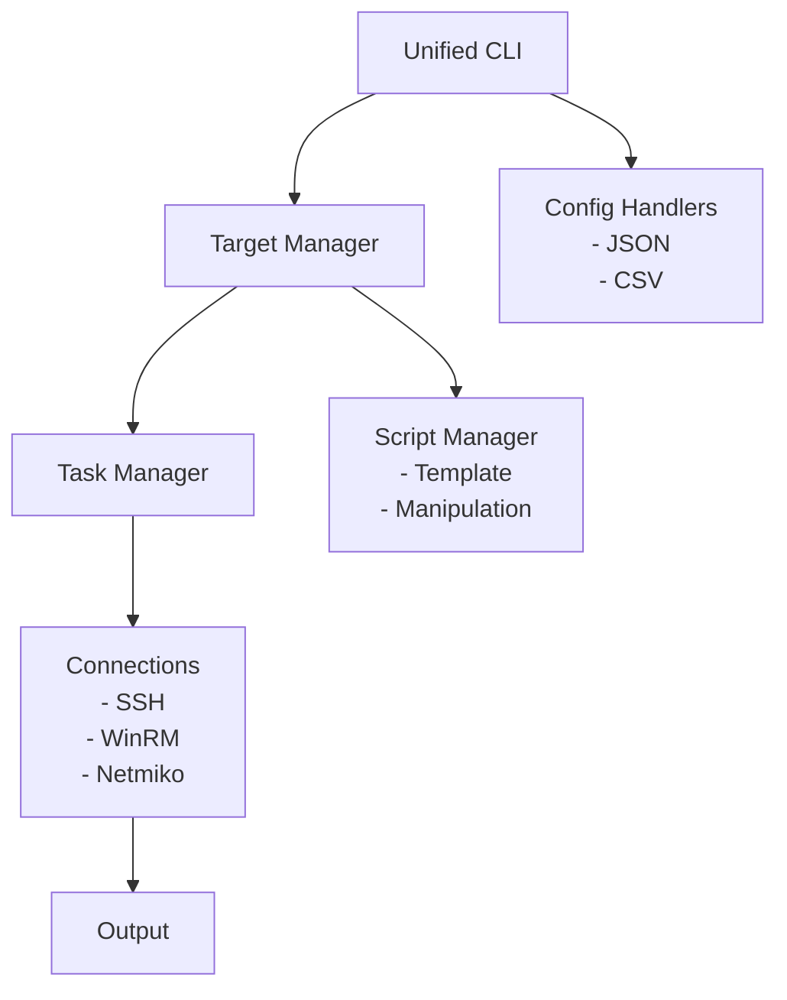

## Overview
Deploy is a remote execution framework similar to Ansible. This creates a unified system for target management, script deployment, and ongoing control for Linux, Windows, and network devices.

## Architecture

## Requirements
- Python 3.6+
- Dependencies: fabric2, paramiko, pypsrp, netmiko, requests_credssp

## Usage
### Basic Usage
```bash
# Execute a command on all hosts defined in a JSON config
python deploy.py -j configs/config.json -k "uptime"

# Execute a script on hosts defined in a CSV file
python deploy.py -c targets.csv -S

# List available hosts and scripts without executing
python deploy.py -j configs/config.json -L
```

### Command Line Options
#### Input Sources (Required - Choose One)
- `-j, --json FILE`: JSON configuration file with host definitions
- `-c, --csv FILE`: CSV file with host information

#### General Options
- `-q, --quiet`: Minimal output mode
- `-v, --verbose`: Enable verbose debug output
- `-d, --scripts DIRECTORY`: Path to scripts directory (default: scripts)
- `-C, --config FILE`: Path to configuration file (JSON format)
- `--version`: Show version information

#### Execution Options
- `-l, --local USERNAME,PASSWORD`: Execute locally with credentials: "username,password"
- `-S, --sudo`: Execute with administrative privileges
- `-s, --ssh`: Force SSH connection for Windows hosts
- `-w, --workers N`: Number of concurrent workers (default: 25)

#### Timeout Configuration
- `--connection-timeout SECONDS`: Connection timeout in seconds (default: 30)
- `--task-timeout SECONDS`: Task execution timeout in seconds (default: 300)
- `--executor-timeout SECONDS`: Overall execution timeout in seconds (default: 1800)

#### Task Options
- `-k, --command CMD`: Execute a shell command on target hosts
- `-a, --arguments ARGS`: Arguments to pass to command or script

#### Filtering Options
- `-f, --filter KEY=VALUE`: Filter hosts and tasks using key=value pairs (comma-separated). Supported keys: os, username, address, port, network, device, hostname, host, task, script. Note: 'hostname' filters by hostname only, 'host' filters by both hostname and IP address. Example: --filter os=windows,task=*.ps1,host=192.168.1.*

#### Output Options
- `-O, --output-format FORMAT`: Output format for results (text or json, default: text)
- `--save-results FILE`: Save execution results to specified file (supports .json or .txt)

#### Other Options
- `-L, --list`: List available hosts and scripts without executing

## Examples

### 1. List All Hosts from a CSV File
```bash
python deploy.py -c inventory.csv -L
```

### 2. Execute a Command on Specific Hosts
```bash
python deploy.py -j configs/config.json -k "uname -a" -f os=linux
```

### 3. Deploy a Script with Arguments
```bash
python deploy.py -j configs/config.json -a "--force" -S
```

## CSV Format
When using CSV files as input, the following columns are supported:
- `hostname`: Hostname or identifier for the target
- `os`: Operating system (linux, windows, etc.)
- `ip`: IP address of the target
- `tcp_ports`: List of open TCP ports (comma-separated)
- `username`: Username for authentication
- `password`: Password for authentication
- `purpose`: Purpose of the host (optional)
- `notes`: Additional notes (optional)

Example:
```csv
hostname,os,ip,tcp_ports,username,password,purpose,notes
web1,ubuntu,192.168.1.10,22,80,443,admin,secret_pass,Web server,Production
db1,centos,192.168.1.20,22,3306,dbadmin,db_pass,Database,Staging
```

## JSON Format
The JSON configuration follows the Deploy format:

### Basic Host Configuration
```json
{
  "web1": {
    "username": "admin",
    "password": "secret_pass",
    "os": "linux",
    "address": "192.168.1.10",
    "port": "22"
  },
  "win1": {
    "username": "Administrator",
    "password": "windows_pass",
    "os": "windows",
    "address": "192.168.1.30",
    "port": "5985"
  }
}
```

### Network Device Configuration
```json
{
  "cisco-switch1": {
    "username": "admin",
    "password": "cisco123",
    "os": "network",
    "address": "192.168.3.10",
    "port": "22",
    "device_type": "cisco_ios",
    "enable_password": "enable_pass"
  },
  "juniper-router1": {
    "username": "admin",
    "password": "juniper123",
    "os": "network",
    "address": "192.168.3.20",
    "device_type": "juniper_junos",
    "global_delay_factor": 2.0,
    "timeout": 120
  }
}
```

### Windows Authentication Methods
```json
{
  "win-basic": {
    "username": "DOMAIN\\Administrator",
    "password": "Password!@",
    "os": "windows",
    "address": "192.168.2.35",
    "port": "5985",
    "auth_protocol": "basic"
  },
  "win-credssp": {
    "username": "DOMAIN\\Administrator",
    "password": "Password!@",
    "os": "windows",
    "address": "192.168.2.36",
    "port": "5985",
    "auth_protocol": "credssp",
    "ssl": true
  },
  "win-certificate": {
    "username": "DOMAIN\\Administrator",
    "os": "windows",
    "address": "192.168.2.37",
    "port": "5986",
    "auth_protocol": "certificate",
    "cert_pem": "path/to/cert.pem",
    "cert_key_pem": "path/to/key.pem",
    "ssl": true,
    "server_cert_validation": "validate"
  }
}
```

## Supported Device Types and Authentication Methods

### Network Device Types
Deploy supports various network device types through Netmiko:
- Cisco IOS (`cisco_ios`)
- Cisco IOS XE (`cisco_ios_xe`)
- Cisco NX-OS (`cisco_nxos`) 
- Juniper JUNOS (`juniper_junos`)
- Arista EOS (`arista_eos`)
- And many others supported by Netmiko

Network devices require the following parameters:
- `device_type`: The type of network device (required)
- `enable_password`: Password for privileged mode access (optional)
- `global_delay_factor`: Factor to adjust command timing (optional, default: 1.0)
- `timeout`: Connection timeout in seconds (optional, default: 100)

### Windows Authentication Methods
Deploy supports multiple authentication methods for Windows targets:
- Basic authentication (`basic`) - Username/password
- CredSSP (`credssp`) - For multi-hop scenarios
- Kerberos (`kerberos`) - Domain authentication
- Certificate (`certificate`) - Certificate-based authentication
- Negotiate (`negotiate`) - NTLM/Kerberos negotiation

Additional Windows parameters:
- `auth_protocol`: Authentication protocol to use (optional, default: "basic")
- `ssl`: Whether to use SSL (optional, default: false)
- `server_cert_validation`: Server certificate validation (optional, default: "ignore")
- `cert_pem`: Certificate file path (required for certificate auth)
- `cert_key_pem`: Certificate key file path (required for certificate auth)

## License

This project is licensed under the GPL v2 License.
